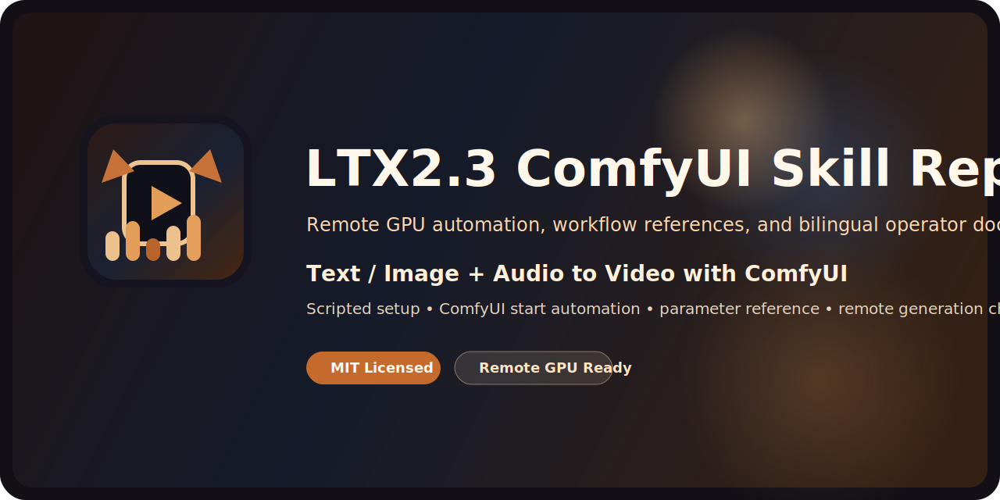

<p align="center">
  
</p>

<div align="center">

# LTX2.3 ComfyUI Skill Repo

Remote GPU automation, documentation, and workflow references for running Isi-dev's LTX 2.3 Text or Image plus Audio to Video setup with ComfyUI.

<p>
  <a href="https://github.com/Sunwood-ai-labs/LTX23-ComfyUI-skill/actions/workflows/docs.yml"></a>
  <a href="./LICENSE"></a>
  
  
</p>

<p>
  <a href="./README.md"><strong>English</strong></a> ·
  <a href="./README.ja.md"><strong>日本語</strong></a> ·
  <a href="https://sunwood-ai-labs.github.io/LTX23-ComfyUI-skill/"><strong>Docs Site</strong></a>
</p>

</div>

## ✨ Overview

This repository turns the archived Isi-dev notebook and App workflow into a reusable operator-facing repository for:

- bootstrapping ComfyUI on a remote GPU machine over SSH
- starting ComfyUI with a repeatable low-VRAM-friendly launch path
- understanding the bundled LTX 2.3 workflow and its exposed parameters
- running real generation checks with local assets and remote GPU execution

The upstream notebook and App JSON remain archived under [sources/upstream/isi-dev](./sources/upstream/isi-dev/). The working guidance lives in [SKILL.md](./SKILL.md), [references](./references/), and the scripts under [scripts](./scripts/).

For API-only execution, use the committed API-format prompt in [sources/api/ltx23-ti2v-audio-api-prompt.json](./sources/api/ltx23-ti2v-audio-api-prompt.json) instead of re-exporting from the UI every time.

## 🚀 Quick Start

1. Run [run-remote-gpu-setup.ps1](./scripts/run-remote-gpu-setup.ps1) from Windows to install ComfyUI, the required custom nodes, and the LTX 2.3 model set on the remote GPU machine.
2. Run [run-remote-gpu-start.ps1](./scripts/run-remote-gpu-start.ps1) to start ComfyUI on the remote host.
3. Import [LTX_2.3_Image_or_Text_&_Audio_2_Video_App_V3.json](./sources/upstream/isi-dev/LTX_2.3_Image_or_Text_&_Audio_2_Video_App_V3.json) into ComfyUI.
4. Provide your prompt, image, and audio assets, then start with a short smoke run before sweeping settings.

The script-first setup flow is documented in [references/scripted-setup.md](./references/scripted-setup.md).

## 🛰️ Remote GPU Workflow

- Setup launcher:
  [run-remote-gpu-setup.ps1](./scripts/run-remote-gpu-setup.ps1)
- Start launcher:
  [run-remote-gpu-start.ps1](./scripts/run-remote-gpu-start.ps1)
- Remote installer:
  [setup-remote-ltx23-comfyui.sh](./scripts/setup-remote-ltx23-comfyui.sh)
- Remote starter:
  [start-remote-comfyui.sh](./scripts/start-remote-comfyui.sh)

The current automation handles three issues that often break ad hoc remote setup:

- missing `LD_LIBRARY_PATH` wiring for NVIDIA user-space libraries
- broken global `pip` logging configs on shared machines
- stale or half-created install directories under `/content/ComfyUI`

## 📚 Documentation

- [Docs site](https://sunwood-ai-labs.github.io/LTX23-ComfyUI-skill/)
- [Scripted setup guide](./references/scripted-setup.md)
- [API prompt source](./sources/api/README.md)
- [Setup and models reference](./references/setup-and-models.md)
- [Experiment tracking reference](./references/experiment-tracking.md)
- [Workflow and parameters reference](./references/usage-and-parameters.md)
- [Source materials and provenance](./references/source-materials.md)
- [Experiment manifests](./experiments/)
- [Japanese README](./README.ja.md)

## 🧩 Repository Layout

```text
.
├─ SKILL.md
├─ README.md
├─ README.ja.md
├─ docs/
├─ references/
├─ scripts/
├─ sources/upstream/isi-dev/
└─ .github/workflows/
```

## 🔎 Included Surfaces

- [SKILL.md](./SKILL.md): the main Codex skill instructions
- [agents/openai.yaml](./agents/openai.yaml): UI metadata for the skill
- [docs](./docs/): public English and Japanese documentation
- [references](./references/): operator-focused setup and workflow notes
- [scripts](./scripts/): remote GPU setup and start automation
- [experiments](./experiments/): committed metadata for real generation batches
- [sources/api](./sources/api/): committed API-format prompt data

## 🪪 License

This project is released under the [MIT License](./LICENSE).

## 🙏 Sources

- [Isi-dev / Google-Colab_Notebooks](https://github.com/Isi-dev/Google-Colab_Notebooks/tree/main)
- [Isi-dev / ComfyUI_LTX2_3](https://github.com/Isi-dev/Google-Colab_Notebooks/tree/main/ComfyUI/ComfyUI_LTX2_3)
- [Lightricks / LTX-2](https://github.com/Lightricks/LTX-2)
- [Lightricks / ComfyUI-LTXVideo](https://github.com/Lightricks/ComfyUI-LTXVideo/)
